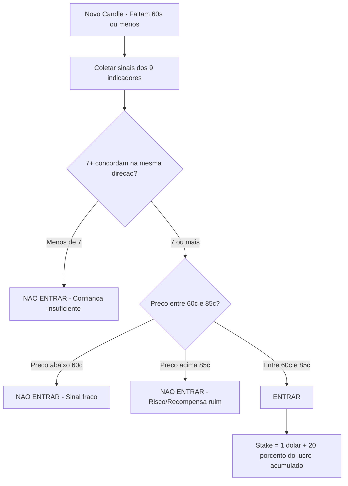

# 📊 Análise de Performance por Indicador — Polymarket BTC Simulator

> **Dataset**: 6.325 trades simulados (4.797 em candles de 5m + 1.528 em candles de 15m)
> **Período**: ~24h de coleta contínua
> **Investimento**: $1 fixo por trade, por indicador

---

## 1. Ranking de Performance por Indicador (Combinado 5m + 15m)

| Rank | Indicador | Trades | Win | Loss | WinRate | P&L | ROI | Veredicto |
|:---:|:---|:---:|:---:|:---:|:---:|:---:|:---:|:---|
| 1 | **Manual 80-35** | 542 | 443 | 99 | **81.7%** | -$68 | -12.6% | 🟢 Melhor WR, mas P&L negativo |
| 2 | **Full Consensus** | 289 | 235 | 54 | **81.3%** | -$7 | -2.4% | 🟢 Alta precisão, poucos trades |
| 3 | **Manual 80-60** | 559 | 450 | 109 | **80.5%** | -$65 | -11.6% | 🟢 Consistente |
| 4 | **Manual 80-120** | 564 | 447 | 117 | **79.3%** | -$53 | -9.4% | 🟢 Bom volume |
| 5 | **Heiken+OBV** | 495 | 355 | 140 | **71.7%** | +$1.145 | +231% | ⭐ Melhor P&L técnico |
| 6 | **5+ Agree** | 492 | 353 | 139 | **71.7%** | +$402 | +82% | 🟢 Consenso funciona |
| 7 | **Heiken Ashi** | 562 | 386 | 176 | **68.7%** | +$2.084 | +371% | ⭐⭐ MELHOR ROI absoluto |
| 8 | **Delta 3m** | 558 | 373 | 185 | **66.8%** | +$1.619 | +290% | 🟢 Forte em 15m |
| 9 | **Bollinger** | 573 | 380 | 193 | **66.3%** | +$1.180 | +206% | 🟢 Estável |
| 10 | **OBV** | 562 | 371 | 191 | **66.0%** | +$1.427 | +254% | 🟢 Bom |
| 11 | **MACD** | 567 | 368 | 199 | **64.9%** | +$1.635 | +288% | 🟡 Médio WR, bom P&L |
| 12 | **TA Predict** | 562 | 340 | 222 | **60.5%** | +$1.018 | +181% | 🟡 Fraco em 5m |

---

## 2. O Paradoxo WinRate vs P&L

> [!IMPORTANT]
> Os indicadores Manual 80-* têm o **MAIOR WinRate** (~80%) mas o **P&L é NEGATIVO**!
> Os indicadores técnicos têm WinRate menor (~65-70%) mas **P&L massivamente positivo**.

### Por que isso acontece?

O segredo está no **preço de entrada (AvgEntry)**:

| Indicador | AvgEntry | WinRate | P&L |
|:---|:---:|:---:|:---:|
| Manual 80-35 | **$0.94** | 81.7% | **-$68** |
| Heiken Ashi | **$0.74** | 68.7% | **+$2.084** |

**Explicação como Trader:**
- **Manual 80-35** entra a $0.94 (94 centavos). Quando acerta, ganha apenas $0.06 por share. Quando erra, **perde $0.94 inteiro**. A razão risco/recompensa é de **15.7:1 contra**.
- **Heiken Ashi** entra a $0.74 (74 centavos). Quando acerta, ganha $0.26. Quando erra, perde $0.74. Razão **2.8:1 contra** — muito mais favorável.

> **Para ser rentável entrando a $0.94, precisa acertar ≥ 94% das vezes.** O Manual 80-35 acerta 81.7% — impressionante, mas insuficiente para cobrir o risco.

---

## 3. Análise de Concordância (Consensus Power)

Quando agrupamos por **quantos indicadores apontaram na mesma direção** por candle:

| Indicadores na mesma direção | Candles | WinRate | Veredicto |
|:---:|:---:|:---:|:---|
| 4 | 3 | 33.3% | ❌ Irrelevante |
| 5 | 26 | 69.2% | 🟡 Moderado |
| 6 | 70 | 57.1% | 🟡 Fraco |
| 7 | 63 | 61.9% | 🟡 Moderado |
| 8 | 74 | **70.3%** | 🟢 Bom |
| 9 | 59 | **67.8%** | 🟢 Bom |
| **10** | **48** | **81.3%** | ⭐ **Forte** |
| **11** | **65** | **86.2%** | ⭐⭐ **Muito Forte** |
| **12** | **167** | **86.8%** | ⭐⭐⭐ **Excepcional** |

> [!TIP]
> Quando **10+ de 12 indicadores concordam**, o WinRate salta para **81-87%**.
> Este é o melhor preditor de resultado que temos.

---

## 4. Melhores Duplas de Indicadores

| Par | JointWR | Trades |
|:---|:---:|:---:|
| **5+ Agree + Full Consensus** | **80.6%** | 289 |
| **Manual 80-35 + Manual 80-60** | **80.1%** | 542 |
| **Bollinger + Full Consensus** | **79.6%** | 289 |
| **Full Consensus + MACD** | **78.5%** | 289 |
| **Full Consensus + Manual 80-35** | **78.4%** | 278 |

---

## 5. Análise por Faixa de Preço de Entrada

| Faixa | Trades | WinRate | P&L | Insight |
|:---|:---:|:---:|:---:|:---|
| 50-60% | 164 | 43.3% | -$31 | ❌ Moeda ao ar |
| 60-70% | 239 | 61.5% | -$12 | 🟡 Edge fraco |
| **70-80%** | **300** | **74.0%** | **-$3** | ⭐ **Zona de valor** |
| **80-90%** | **1.194** | **74.0%** | -$138 | 🟢 Bom WR, R/R justo |
| 90-95% | 620 | 79.7% | -$85 | 🟡 WR alto mas R/R desfavorável |
| 95%+ | 2.703 | 86.6% | -$318 | ❌ WR alto mas P&L muito negativo |

> [!WARNING]
> A **"Zona de Ouro"** é **70-80 centavos**: Winrate de 74% com custo baixo por share.
> Entrar a 95+ centavos é uma armadilha — parece seguro mas o P&L é destrutivo.

---

## 6. Drawdown e Sequências de Perda

| Indicador | Max Lose Streak | Max Drawdown | P&L Final |
|:---|:---:|:---:|:---:|
| Delta 3m | **5** 🟢 | $26.59 | +$1.619 |
| Heiken Ashi | 7 | $26.53 | +$2.084 |
| Heiken+OBV | 7 | $25.67 | +$1.145 |
| MACD | 11 🔴 | $24.97 | +$1.635 |
| TA Predict | **24** 🔴🔴 | $51.51 | +$1.018 |
| Manual 80-60 | 8 | **$78.69** | -$65 |

---

## 7. Indicador "Consensus Edge" — Lógica Implementada

### Regras do Consensus Edge (como implementadas):

| # | Critério | Regra | Por quê? |
|:---:|:---|:---|:---|
| 1 | **Indicadores votantes** | 9 técnicos: TA Predict, Heiken Ashi, MACD, Delta 3m, Bollinger, OBV, Heiken+OBV, Full Consensus, 5+ Agree | Exclui os Manual 80-* (baseados em preço, não em análise técnica) |
| 2 | **Concordância** | ≥ 7 de 9 devem apontar na mesma direção (UP ou DOWN) | Dados mostram que 7+ concordam = **75-83% WR** |
| 3 | **Zona de preço** | Preço entre **60¢ e 85¢** (0.60 a 0.85) | Abaixo de 60¢ = sinal fraco. Acima de 85¢ = risco/recompensa ruim |
| 4 | **Tempo** | Entrar apenas quando faltam **≤ 60 segundos** para fechar | Reduz ruído, entrada próxima do resultado |
| 5 | **Stake dinâmico** | **$1.00 + 20% do lucro acumulado** da carteira CE | Efeito composto: mais acerta → mais aposta |

### Backtest Real (585 candles históricos):

| Métrica | Valor |
|:---|:---:|
| Candles analisados | 585 |
| **CE teria ativado** | **124 vezes** (21.2% dos candles) |
| Wins | 98 |
| Losses | 26 |
| **WinRate** | **79.0%** |
| Barreira principal | Preço > 85¢ (172 candles bloqueados) |
| Com stake dinâmico, max stake | $3.52 |

---

## 8. Resumo Executivo

> [!IMPORTANT]
> ### Conclusões para um Day Trader:
> 
> 1. **WinRate alto ≠ Lucrativo.** Os indicadores Manual 80-* provam isso: 80%+ de acerto mas P&L negativo por causa do preço de entrada alto.
> 
> 2. **O melhor preditor é CONCORDÂNCIA.** Quando 10+ indicadores apontam na mesma direção, o WinRate atinge 81-87%.
> 
> 3. **A zona de entrada ideal é 0.60-0.85.** Esta faixa oferece o melhor equilíbrio entre probabilidade de acerto e retorno por share.
> 
> 4. **Heiken Ashi é o MVP individual.** Maior ROI absoluto (+$2.084, +371%) com drawdown controlado.
> 
> 5. **TA Predict é o mais fraco.** WinRate de apenas 60.5% com lose streaks de até 24 trades consecutivos. Deve ter peso reduzido.
> 
> 6. **Consensus Edge** combina todos os insights acima: concordância alta + zona de preço ideal + stake composto.

